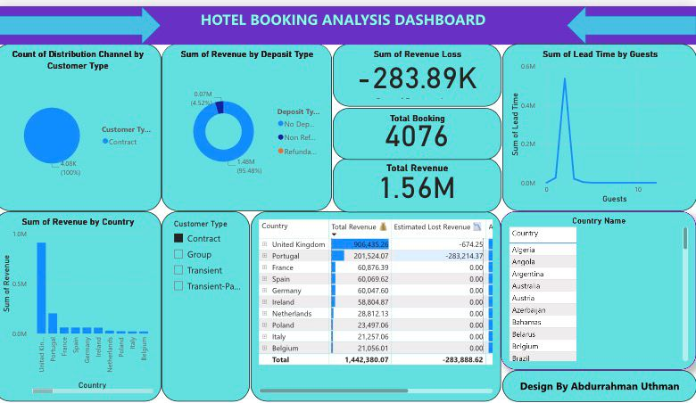
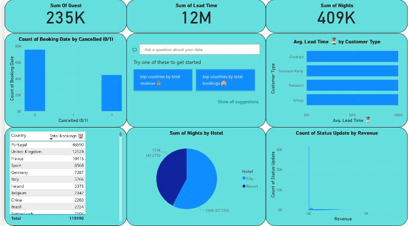

# 🏨 Hotel Booking Analysis Dashboard

## Project Overview

This repository contains a comprehensive interactive dashboard for analyzing hotel booking patterns, revenue performance, and key operational metrics. The analysis provides deep insights into customer behavior, cancellation rates, lead times, and revenue generation across different customer types and countries, enabling data-driven strategic decisions for hotel management.

The original design was created by **Abdurrahman Uthman**.

## ✨ Key Features & Metrics

The dashboard is designed to provide quick and actionable insights through several key visualizations and calculated metrics:

| Metric/Insight | Description |
| :--- | :--- |
| **Total Revenue & Loss** | Displays the sum of revenue generated and the total estimated revenue loss due to cancellations. |
| **Total Bookings & Guests** | Key high-level figures for total bookings and the total number of guests. |
| **Booking & Cancellation Trend** | Analyzes the count of bookings and the breakdown of bookings that were **Cancelled (1)** versus **Not Cancelled (0)**. |
| **Customer Segmentation** | Breaks down revenue, lead time, and distribution channel by **Customer Type** (e.g., Transient, Group, Contract). |
| **Geographic Performance** | Identifies the **Top Performing Countries** by total revenue and total bookings. |
| **Lead Time Analysis** | Visualizes the average lead time (days between booking and arrival) by customer type and its distribution across guests. |
| **Hotel Type Breakdown** | Shows the distribution of bookings (Sum of Nights) across different **Hotel Types** (e.g., City vs. Resort). |
| **Deposit Type Impact** | Analyzes revenue based on the **Deposit Type** (e.g., No Deposit, Non-Refundable, Refundable). |

## 📊 Data Source

The dashboard utilizes a detailed dataset of hotel booking transactions.

* **Source File:** `Hotel booking.xlsx - Sheet1.csv`
* **Size:** Over 119,000 records
* **Key Data Points:** Includes `Booking ID`, `Hotel`, `Arrival Date`, `Lead Time`, `Nights`, `Guests`, `Customer Type`, `Country`, `Cancelled (0/1)`, `Revenue`, and `Revenue Loss`.

## 🚀 Future Enhancements

* Incorporate time intelligence to analyze **Month-over-Month (MoM)** and **Year-over-Year (YoY)** performance.
* Develop a predictive model to estimate the **likelihood of a booking being cancelled**.
* Add external data (e.g., local events or competitor pricing) to enrich the analysis.
